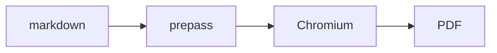

# 如何在文档中插入图表（以及 PDF 之外的导出格式）

本指南介绍 `/make-pdf` 和 `/diagram`（v1.58.0.0+）附带的图表 + 多格式引擎。这里的一切完全离线运行：mermaid 和 excalidraw 运行时内置在 `lib/diagram-render/` 中，加载到浏览守护进程的 Chromium 中。渲染时无需 CDN，无需网络。

## 在 PDF 中渲染 mermaid 图表

在 markdown 中插入一个围栏即可。就这样。

````markdown

````

```bash
make-pdf generate doc.md out.pdf
```

围栏渲染为**矢量**图表（在任何缩放下都清晰，文本可选中），`title` 作为标题和无障碍标签。原始的 mermaid 源以 base64 编码保存在图形的 `data-gstack-source` 属性中，用于调试和往返（HTML 注释会损坏 mermaid 的 `-->` 箭头）。一个注意事项：围栏必须从**第 0 列**开始 — 缩进的围栏（例如在列表中）按设计保持为纯代码块。

**围栏选项**（在信息字符串中以空格分隔）：

| 选项 | 效果 |
|---|---|
| `title="..."` | 图表下方的标题 + `aria-label` |
| `render=false` | 将围栏保持为纯代码块 |
| `page=landscape` | 强制此图表到其自己的横向页面 |
| `page=portrait` | 否决此图表的自动横向 |

解析失败的围栏渲染为响亮的红色诊断块，带有解析错误和源代码摘录 — 您的文档仍然构建，错误不可能被错过。

` ```excalidraw ` 围栏以相同方式工作；正文是完整的 `.excalidraw` 场景文件（excalidraw.com 使用 File → Save 保存的内容）。

## 控制图像大小和方向

本地图像自动内联（相对路径针对 markdown 文件解析）且**从不截断** — 每个图像限制在内容框内。超大照片降采样到打印分辨率（内容宽度下 300dpi），因此手机照片不会膨胀文档。

图像安全默认值：远程（http/https）图像被**阻止并显示占位符**，除非您传递 `--allow-network`。解析到markdown目录之外的图像路径（即使通过符号链接）仍然内联但会大声警告。超过 64MB 的文件和非常规文件（fifo、设备）会降级为占位符而不是挂起渲染。

每图像指令紧跟在图像之后：

```markdown
{width=full}
{width=2in}
{page=landscape}
{page=portrait}
```

`width=` 接受 `full`、百分比（`50%`）或尺寸（`3in`、`8cm`、`200px`）。`page=` 强制或否决专用的横向页面。

**自动横向**：宽小的、文字较小的、类似图表的图像自动获得其自己的垂直居中横向页面 — 在纵向文档内部。启发式是故意保守的（宽高比 ≥ 1.8，固有宽度超过内容框的 ~2.5 倍，以及类似图表的 alt 词：diagram / architecture / flowchart / chart / graph）。如果它没有在需要时触发，添加 `{page=landscape}`；如果它在不需要时触发，添加 `{page=portrait}`。

## 导出单文件 HTML 或 Word

```bash
make-pdf generate doc.md out.html --to html
make-pdf generate doc.md out.docx --to docx
```

- **`--to html`** 写入一个自包含文件：图表为内联 SVG，图像为数据 URI，零网络引用（在默认离线姿态下 — `--allow-network` 故意保持远程图像标签活跃），加上屏幕阅读层（居中的度量，填充）。通过邮件发送，附加到任何地方打开。
- **`--to docx`** 是内容保真导出：标题、表格、代码块、列表和图表（作为带有 alt 文本的 300dpi PNG 嵌入）保留。页面完美布局不会 — 这是 Word 打开后的工作。

注意：`--to` 是输出格式。`--format` 是 `--page-size` 的旧别名 — 不同的东西。

## 从英文生成图表

```
/diagram make a flowchart of our deploy pipeline: build, test, canary, promote
```

该技能创作 mermaid 并发出一个**三元组**：

| 文件 | 用途 |
|---|---|
| `<slug>.mmd>` | 源真相 — 编辑和重新渲染 |
| `<slug>.excalidraw` | 在 excalidraw.com 中打开（File → Open），移动框，交回 |
| `<slug>.svg` / `<slug>.png` | 文档、问题、README、聊天 |

流程图转换为完全可编辑的 excalidraw 场景。其他 mermaid 类型（sequence、state、gantt）很好地渲染为 SVG/PNG 但跳过 `.excalidraw` 工件 — 技能会告诉您的上游转换器限制。

对于文档，在您的 markdown 中嵌入 `.mmd` 源而不是 PNG — `/make-pdf` 将其渲染为矢量，图表永远保持可编辑。

## CI: 响亮地失败而不是发布占位符

```bash
make-pdf generate docs.md --strict
```

缺失的本地图像、被阻止的远程图像、树外图像读取（通过符号链接解析到 markdown 目录之外的路径或符号链接）、超大文件（>64MB）和非常规文件都退出非零，而不是降级为警告或占位符 — 对于破损图像应该中断构建的文档管道。

## 故障排除

- **"diagram-render bundle not found"** → 在 gstack repo 中运行 `bun run build:diagram-render`，或重新运行 `./setup`。
- **图表渲染但看起来被挤压在内联中** → 它很宽；在围栏上用 `page=landscape` 给它空间。
- **双行"赛道"循环而非一长行：** mermaid 子图技巧 — 顶级 `flowchart TB`，两个子图具有 `direction LR` 和 `direction RL`，连接*子图*（跨子图边界的节点级边会静默禁用 `direction`）。
- **"[remote image blocked]"占位符** → 远程图像默认从不获取（离线姿态）；标签被替换为可见的占位符，因此 Chromium 也无法在打印时获取它。传递 `--allow-network` 以选择加入。
