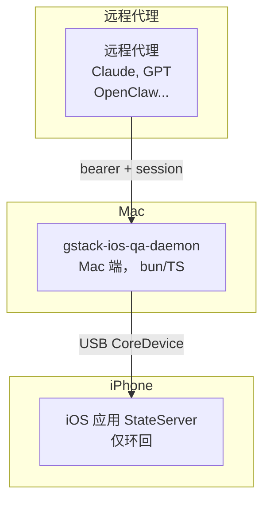

# 如何使用 GStack iOS 测试 iOS 应用

这是 gstack 随附的 iOS QA 功能的端到端操作向导：将规范的 Swift 模板安装到您的应用中，通过 USB 连接真实的 iPhone，然后从任何代理（本地的 Claude Code，或通过 Tailscale 的任意 HTTP 代理）来操控设备。无需模拟器、无需 XCTest 框架、无需 WebDriverAgent。

以下所有内容已在运行 iOS 26.5 的真实 iPhone 17 Pro Max 上进行了端到端验证。同样的流程适用于任何 iOS 16+ 设备。

## 所需准备

- 已安装 Xcode 16.0+ 的 macOS（`xcrun devicectl --version` 必须成功执行）。Xcode 16 附带了 CoreDevice 隧道，`devicectl` 通过它连接到 USB 设备。
- 运行 iOS 16 或更新版本的真实 iPhone。已解锁、已与 Mac 配对，并在 设置 → 隐私与安全性 中开启了**开发者模式**。
- Apple 开发团队 — 免费的个人团队即可用于真机调试部署。您需要的是团队 ID（例如 `623FYQ2M88`），而非证书 ID。在 Xcode → 设置 → 账户 → 您的 Apple ID → 团队列表中查找。首次部署时，设置会通过 `-allowProvisioningUpdates -allowProvisioningDeviceRegistration` 为设备安装签名。
- 已安装的 gstack（`./setup` 已完成；`bin/gstack-ios-qa-daemon` 必须在磁盘上且可执行）。
-  PATH 中的 Bun 运行时（`bun --version`）。Mac 端的守护进程是一个 bun 进程。

对于可选的远程代理（Tailscale）模式，您还需要在 Mac 上安装 Tailscale，并确保 `/var/run/tailscale.sock` 可读。

## 一图胜千言



- iOS 应用内嵌了一个 `StateServer`（`DebugBridge` Swift 包库，仅限 `#if DEBUG`），监听 `::1` + `127.0.0.1` 端口 9999。通过 Bearer Token 守护。启动令牌在守护进程生成后 ~5 秒内轮换，因此此后任何抓取 `os_log` 的行为只能看到一个已废弃的凭证。
- Mac 守护进程通过 `xcrun devicectl` 在连接配对设备时自动打开的 CoreDevice IPv6 隧道来中转流量。
- 在 Tailscale 模式下，守护进程暴露一个绑定到您的 tailnet IP 的独立监听器，每个会话令牌强制执行能力层级（观察 / 交互 / 修改 / 恢复）。令牌由 Mac 主人通过 `gstack-ios-qa-mint` 显式铸造；远程调用者永远不会被自动加入允许列表。

iOS `StateServer` **始终**仅限环回，即使在远程模式下也是如此。身份验证在 Mac 端进行，因为 iPhone 无法验证 Tailscale 身份。

## 第一步：为 iOS 应用添加 DebugBridge 模板

模板位于 `./setup` 完成后的 `~/.claude/skills/gstack/ios-qa/templates/`。最快的安装方式是在 Claude Code 中从应用根目录调用 `/ios-qa` 技能 — 它会读取您的 Swift 源码，生成类型化的 `@Observable` 状态访问器，并使用您的 bundle ID 布置模板。或者手动操作：

1. 将以下文件复制到应用工作区内的 `DebugBridge/` Swift 包管理器（SPM）包中：
   - `Sources/DebugBridgeCore/StateServer.swift`（来自 `StateServer.swift.template`）
   - `Sources/DebugBridgeCore/DebugBridgeManager.swift`（来自 `DebugBridgeManager.swift.template`）
   - `Sources/DebugBridgeTouch/DebugBridgeTouch.m` + `Sources/DebugBridgeTouch/include/DebugBridgeTouch.h`（来自两个 `.template` 文件）
   - `Sources/DebugBridgeUI/Bridges.swift`（来自 `Bridges.swift.template`）
   - `Sources/DebugBridgeUI/DebugOverlay.swift`（来自 `DebugOverlay.swift.template`）
   - `Package.swift`（来自 `Package.swift.template`）
2. 将该包添加为应用的本地依赖。依赖 `DebugBridgeUI` 产品，条件为 `condition: .when(configuration: .debug)`。`DebugBridgeCore` 和 `DebugBridgeTouch` 会传递引入。
3. 在您的 `@main` App 初始化中，以 `#if DEBUG` 控制接线：

   ```swift
   #if DEBUG
   import DebugBridgeCore
   StateServer.shared.start()
   #if canImport(UIKit)
   import DebugBridgeUI
   DebugBridgeUIWiring.installAll()
   #endif
   #endif
   ```

三个 Swift 目标的分层：`DebugBridgeCore` 是跨平台的（因此 CI Mac 主机上的 `swift build` 可以在没有 UIKit 的情况下验证大部分代码），`DebugBridgeUI` 和 `DebugBridgeTouch` 仅限 iOS（它们链接 UIKit）。`DebugBridgeTouch` 是 Objective-C — 它承载 KIF 派生的 UITouch 合成，以及让 SwiftUI Button 点击真正触发的 iOS 18+ `_UIHitTestContext` 修复。

结构性的 Release 构建防护是 `Package.swift` 中的 `.when(configuration: .debug)` 子句。SwiftPM 在 Release 构建中拒绝链接任何 `DebugBridge*` 目标，因此即使您忘记清理，桥接也无法发布到 TestFlight。

## 第二步：构建并安装到设备

从应用的项目目录运行：

```
xcodebuild \
  -scheme YourAppScheme \
  -configuration Debug \
  -destination 'generic/platform=iOS' \
  -derivedDataPath /tmp/build \
  -allowProvisioningUpdates -allowProvisioningDeviceRegistration \
  CODE_SIGN_STYLE=Automatic \
  DEVELOPMENT_TEAM=YOUR_TEAM_ID \
  build
```

然后安装并启动：

```
UDID=$(xcrun devicectl list devices 2>/dev/null | awk 'NR>2 && $0!="" {print $(NF-2); exit}')
xcrun devicectl device install app --device "$UDID" /tmp/build/Build/Products/Debug-iphoneos/YourApp.app
xcrun devicectl device process launch --device "$UDID" --terminate-existing your.bundle.id
```

如果手机已锁定，您将得到 `FBSOpenApplicationServiceErrorDomain error 1 — Locked`。解锁后重试。首次安装会在手机上弹出信任对话框；点击信任，然后重新运行。

## 第三步：启动 Mac 端守护进程

两种方式。

**选项 A — 让技能来启动。** 在 Claude Code 中从任何位置运行 `/ios-qa`；技能按需启动守护进程，引导隧道，轮换启动令牌，并通过代理暴露设备。本地 USB 使用最简洁的路径。

**选项 B — 自己启动。** 运行：

```
gstack-ios-qa-daemon
```

守护进程在两个环回监听器都已绑定后打印 `READY: port=<n> pid=<pid>`。默认端口是 9099。启动者可以使用 ~5 秒的超时来读取该行以确认就绪；您也可以将 `curl` 指向打印的端口。

无论哪种方式，守护进程都会对 `~/.gstack/ios-qa-daemon.pid` 持独占文件锁 — 从两个 Claude Code 会话中运行两次是安全的；第二次调用会发现自己守护进程的端口并加入。

设置这些环境变量以指定特定设备或包：

```
GSTACK_IOS_TARGET_UDID=248C3A58-B843-5BDB-8F5D-89ADB7D7BF6A
GSTACK_IOS_TARGET_BUNDLE_ID=com.yourorg.yourapp
GSTACK_IOS_DAEMON_PORT=9099       # 环回监听器端口；默认 9099
```

如果未设置 `GSTACK_IOS_TARGET_UDID`，守护进程会选择第一个已配对且连接的设备。

## 第四步：操控设备

守护进程运行后，您在 `http://127.0.0.1:9099`（或 `[::1]:9099`）拥有一个 HTTP 接口。技能流程会为您完成此操作，但原始端点如下：

| 端点 | 功能 | 认证 |
|---|---|---|
| `GET /healthz` | 版本探测。 | 无（环回） |
| `POST /auth/rotate` | 仅限守护进程；将启动令牌轮换为仅内存中的值。 | 启动令牌 |
| `POST /session/acquire` | 获取每设备会话锁。返回 `{session_id, ttl_seconds}`。 | Bearer |
| `POST /session/release` | 释放锁。 | Bearer + session |
| `GET /screenshot` | 捕获活动窗口的 PNG。返回 `{png_base64: "..."}`。 | Bearer |
| `GET /elements` | 无障碍树快照。 | Bearer |
| `GET /state/snapshot` | 将所有 `@Snapshotable` 字段转储为 JSON。 | Bearer |
| `POST /state/restore` | 原子性地恢复完整快照。 | Bearer + session，mutate 层级 |
| `POST /tap` `{x,y}` | 在窗口坐标处合成真实的 UITouch。SwiftUI Button 会触发。 | Bearer + session，interact 层级 |
| `POST /swipe` `{from_x,from_y,to_x,to_y}` | 滚动最近的包含 UIScrollView。 | Bearer + session，interact 层级 |
| `POST /type` `{text}` | 在当前第一响应者上设置文本。 | Bearer + session，interact 层级 |

修改请求需要 `Authorization: Bearer ***` 头和 `X-Session-Id` 头。只读端点（`/screenshot`、`/elements`、`GET /state/*`）只需要 Bearer。

状态快照通过规范状态结构体上的 `@Snapshotable` 属性包装器按字段选择加入。您不注释的字段永远不会出现在快照中，这默认将令牌、PII 和认证状态排除在录制的固件之外。

## 第五步：让远程代理工作（可选）

要让另一台机器上的代理控制设备，请使用 `--tailnet` 运行守护进程：

```
gstack-ios-qa-daemon --tailnet
```

守护进程首先探测 `/var/run/tailscale.sock`；如果套接字缺失或不可读，它完全拒绝打开 tailnet 监听器（环回仍然运行）。远程模式永远不会半途启动。

然后为应该能够连接的身份铸造一个会话令牌：

```
gstack-ios-qa-mint grant --remote 'alice@example.com' --capability interact
gstack-ios-qa-mint grant --remote 'tag:ci' --capability mutate --ttl 86400 --note 'nightly'
gstack-ios-qa-mint list
```

能力层级是嵌套的：`observe`（仅只读端点）⊂ `interact`（点击、滑动、输入）⊂ `mutate`（`POST /state/*`）⊂ `restore`（`POST /state/restore`）。选择完成任务的最小层级。允许列表文件位于 `~/.gstack/ios-qa-allowlist.json`（权限 0600）— 守护进程在每个 `/auth/mint` 请求时读取它，因此更改立即生效，无需重启。

远程代理然后向守护进程的 tailnet 监听器发起 POST /auth/mint 请求。守护进程通过 tailscaled 的 WhoIs 端点规范化调用者的身份，检查允许列表，并返回一个短期的会话令牌（默认 1 小时，上限 24 小时）。每个已认证的修改请求都会记录到 `~/.gstack/security/ios-qa-audit.jsonl`；被拒绝的请求记录到 `~/.gstack/security/attempts.jsonl`。

## 第六步：发布 Release 构建

在发布到 TestFlight 或 App Store 之前，运行 `/ios-clean`。它会移除 `DebugBridge` SPM 依赖并从您的 `@main` App 中剥离 `#if DEBUG` 接线。`Package.swift` 中的结构防护（`condition: .when(configuration: .debug)`）意味着 Release 构建即使您忘记清理也不会链接桥接，但 `/ios-clean` 给您一个干净的差异来审查和发布。

## 常见故障

| 症状 | 问题所在 |
|---|---|
| `xcodebuild` 失败，报 `Could not locate device support files for iOS X.Y` | 运行 `xcodebuild -downloadPlatform iOS` 以下载您 iPhone iOS 版本的设备支持包（~8GB）。 |
| 安装成功，`process launch` 失败，报 `Locked` | 手机已锁定。解锁后重试。 |
| 在配对设备上首次安装失败，无明显错误 | 手机需要信任 Mac。在手机上打开 设置 → 通用 → VPN 与设备管理 并确认。 |
| 设置 → 隐私 中缺少 `开发者模式` 开关 | 将设备连接到 Xcode → 窗口 → 设备与模拟器 一次，或尝试对该设备执行任何 `devicectl device install`。iOS 将在第一次尝试后显示该开关。 |
| `xcrun devicectl device copy from` 返回 ERROR 7000 | 源路径错误 — 启动令牌位于应用数据容器内的 `tmp/gstack-ios-qa.token`（NSTemporaryDirectory），而非路径根目录。 |
| `/healthz` 返回 200，但 `/tap` 返回 ok:true 且 UI 无变化 | 手机已配对，但 StateServer 端口可能在启动之间发生了变化。重新解析 CoreDevice IPv6（`dscacheutil -q host -a name '<DeviceName>.coredevice.local'`）。 |
| `/auth/mint` 返回 `403 identity_not_allowed` | 远程调用者的身份不在 Mac 的允许列表上。在 Mac 上运行 `gstack-ios-qa-mint grant --remote <identity> --capability interact`。 |
| 守护进程无法打开 tailnet 监听器 | Tailscale 未安装，或 `/var/run/tailscale.sock` 不可读。修复 Tailscale，然后重启守护进程。环回在此期间仍然运行。 |
| SwiftUI Button 点击返回 `ok:true` 但操作从未触发 | 您使用的是 iOS 17 或更早版本，其中 `_UIHitTestContext` 不存在。DebugBridgeTouch 实现回退到普通 `hitTest:`，它无法解析到 SwiftUI 手势容器中。在设备上更新到 iOS 18+，或点击 UIKit 控件。 |

## 这为您带来什么

您可以使用任何支持 HTTP 的语言编写代理循环。截图，询问模型要做什么，发送点击。在前后捕获状态快照以录制确定性固件用于 `/ios-fix` 回归测试。将同事添加到允许列表，他们就可以通过 Tailscale 从他们的笔记本电脑操控您的 iPhone，无需接触硬件。通过铸造具有 mutate 层级能力和 24 小时 TTL 的 `tag:ci` 会话令牌，将同一守护进程连接到 CI。

整个技术栈是您已经拥有的 Mac、您已经拥有的 iPhone、免费的 Apple 开发者账户和 gstack。无需付费测试服务。无模拟器漂移。用户看到的就是代理操控的样子。
